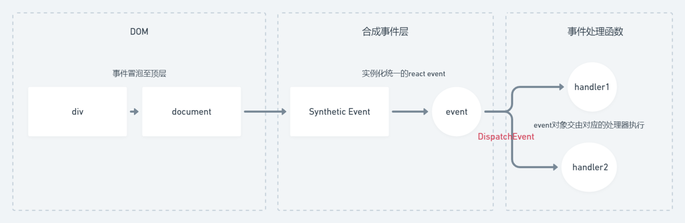
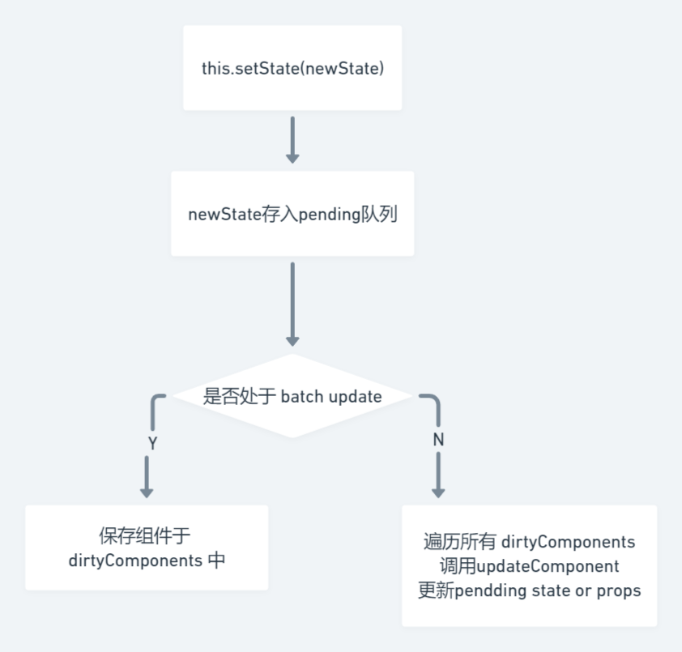
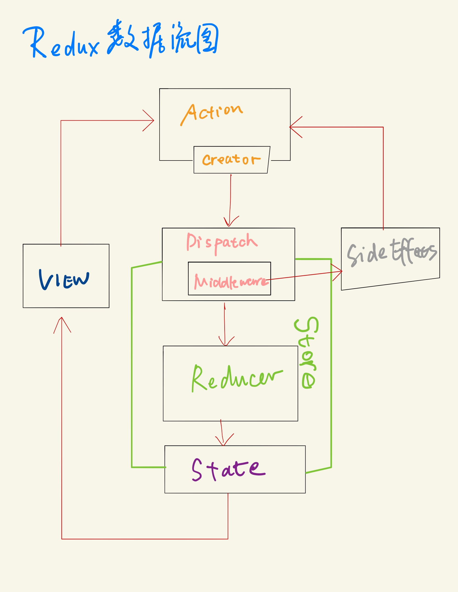
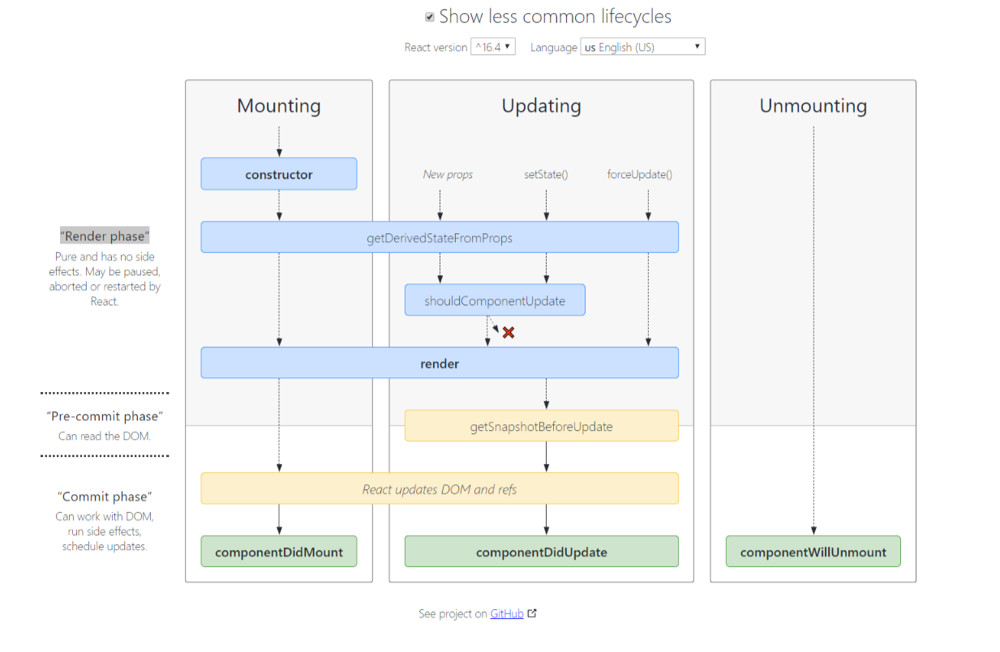

# Learn React

## React原理

> whimsical 图：https://whimsical.com/XHck3w2Q6n5MiBsQ31a2qS

### 回顾vdom和diff

- h函数
- vnode数据结构
- patch函数

diff算法

- 只比较同一层级，不跨级比较
- tag不相同，则直接删掉重建，不再深度比较
- tag和key两者都相同，认为是相同节点，不再深度比较

### JSX本质

> 查看react编译结果：[Babel](https://babeljs.io/repl)

编译后为createElement函数（h函数 ），返回vnode。

```
// 参数一：标签名 / 组件变量
// 参数二：attributes
// 参数三及往后：children / text
React.createElement('tagname', null, [])
React.createElement('tagname', null, child1, child2, ...) 
```

组件名首字母大写（React规定），用于区分html tag / 自定义tag

### 合成事件

- 所有事件挂载到document上
- event不是原生的，是SyntheticEvent合成事件对象
- 和Vue事件不同，和dom事件也不同



优势：

- 更好的兼容性和跨平台
- 载到document，减少内存消耗，避免频繁解绑
- 方便事件的统一管理（事务机制）

### setState和batchUpdate

- 有时异步（普通使用），有时同步（setTimeout、DOM事件）
- 有时合并（对象形式），有时不合并（函数形式）



同步setState过程

```js
isBatchingUpdates = true

this.setState({
	count: this.state.count + 1,
});

isBatchingUpdates = false
```

异步setState过程

```js
isBatchingUpdates = true

setTimeout(() => {
	// 此时 isBatchUpdates === false，直接更新
    this.setState({
        count: this.state.count + 1,
    });
}, 0);

isBatchingUpdates = false
```

总结：

- setState无所谓异步还是同步
- 看是否能命中 batchUpdate 机制
- 判断 isBatchingUpdates

哪些能命中batchUpdate机制（React可以管理的入口）

- 生命周期（和它调用的函数）
- React中注册的事件（和它调用的函数）

哪些不能batchUpdate函数（React管不到的入口）

- setTimeout, setInterval
- 自定义DOM事件

### transaction 事务机制

定义`initialize`和`close`钩子，在自定义函数初始化时包裹。

### 组件渲染和更新过程

- JSX如何渲染为页面
- setState之后如何更新页面
- 面试考察全流程

#### 渲染过程

- props state
- render()生成vnode
- patch(elem, node)

#### 组件更新过程

- setState(newState) -> dirtyComponents
- render生成newVnode
- patch(node, newNode)

#### 更新的两个阶段(patch的拆分)

- reconciliation阶段 - 执行diff算法，纯JS计算
- commit阶段 - 将 diff 结果渲染 DOM

### React fiber

性能问题：

- JS是单线程，和DOM渲染共用一个线程
- 当组件足够复杂，组件更新的计算和渲染压力大
- 同时有DOM操作需求（动画，鼠标拖拽）将卡顿

解决方案 fiber：

- 将reconciliation 阶段进行任务拆分（commit无法拆分）
- DOM需要渲染时暂停，空闲时恢复
  - window.requestIdleCallback

## React面试真题演练

### 组件之间如何通讯？

- 父子组件props
- 自定义事件
- redux和Context

### 同步JSX本质是什么？

- createElement
- 执行返回vnode

### Context是什么，如何应用？

- 父组件，向其下所有子孙组建传递信息
- 一些简单的公共信息：主题色，语言等
- 复杂的公共信息，请用redux

### shouldComponentUpdate用途

- 性能优化
- 配合不可变值

### redux单项数据流



### setState场景题

```js
componentDidMount() {
	// count 初始值为 0
    this.setState({ count: this.state.count + 1 })
    console.log('1', this.state.count)  // 0， 异步，合并
    
    this.setState({ count: this.state.count + 1 })
    console.log('2', this.state.count)  // 0， 异步，合并
    
    setTimeout(() => {
        this.setState({ count: this.state.count + 1 })
        console.log('3', this.state.count)  // 2，同步
    })
    
    setTimeout(() => {
        this.setState({ count: this.state.count + 1 })
        console.log('4', this.state.count)  // 3，同步
    })
}
```

### 什么是纯函数

返回一个新值，没有副作用（不会修改其他值）

重点：不可变值

如arr1 = arr1.slice()

### React组件生命周期

> [Lifecycle Diagram](https://projects.wojtekmaj.pl/react-lifecycle-methods-diagram/)

- 单组件生命周期
- 父子组件生命周期
- 注意SCU



### React发起ajax应该在哪个生命周期

componentDidMount

### 渲染列表为何使用key

diff算法通过tag和key来判断是否sameNode，减少渲染次数，优化性能

### 函数组件和class组件区别

- 纯函数，输入props，输出jsx

- 没有实例，没有生命周期，没有state

- 不能扩展其他方法

### 什么是受控组件？

- 表单的值，受state控制
- 需要自行监听 onChange，更新state
- 对比非受控组件

### 何时使用异步组件

- 加载大组件
- 路由懒加载
- React.Suspense和React.lazy API

### 多个组件抽离公共逻辑

- 高阶组件
- Render Props
- mixin已被React废弃

### Redux如何进行异步请求

- 使用异步action
- redux-thunk 插件

### React-router如何配置懒加载

```react
import React from 'react'
import { BrowserRouter as Router, Route, Switch } from 'react-router-dom'

const Home = React.lazy(() => import('./routes/Home'))
const App = () => (
	<Router>
		<Switch>
			<Route exact path="/" component={Home} />
		</Switch>
	</Router>
)
```

### PureComponent是什么

- 实现了浅比较的shouleComponentUpdate

- 优化性能

- 结合不可变值使用

### React事件和DOM事件的区别

- 所有事件挂在到document上
- event不是原生的，是`SyntheticEvent`合成事件对象
- dispatchEvent

### React性能优化

- 渲染列表时加key
- 自定义时间、dom事件及时销毁
- 合理使用异步组件
- 减少函数bind this的次数合理使用SCU `PureComponent`和`memo`
- 合理使用`Immutable.js`
- webpack层面的优化
- 前端通用的性能优化(图片懒加载)
- 使用SSR

### React和Vue区别

相同点：

- 都支持组件化
- 都是数据驱动视图
- 都是用vdom操作DOM

区别：

- React使用JSX拥抱JS，Vue使用模板拥抱HTML
- React函数式编程，Vue声明式编程
- React需要自力更生，Vue把想要的都给你

